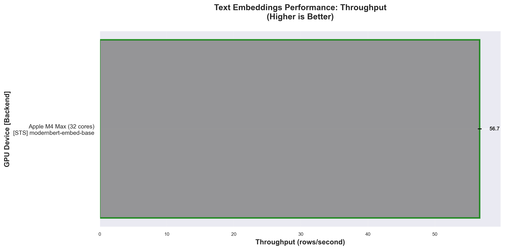
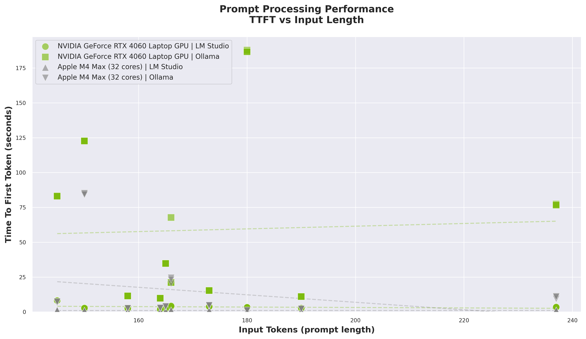
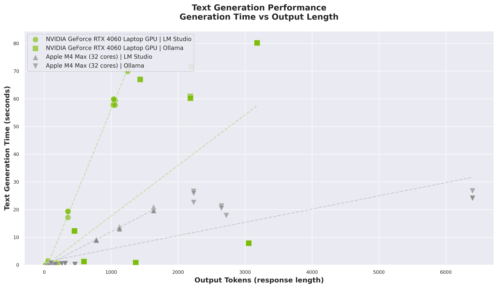
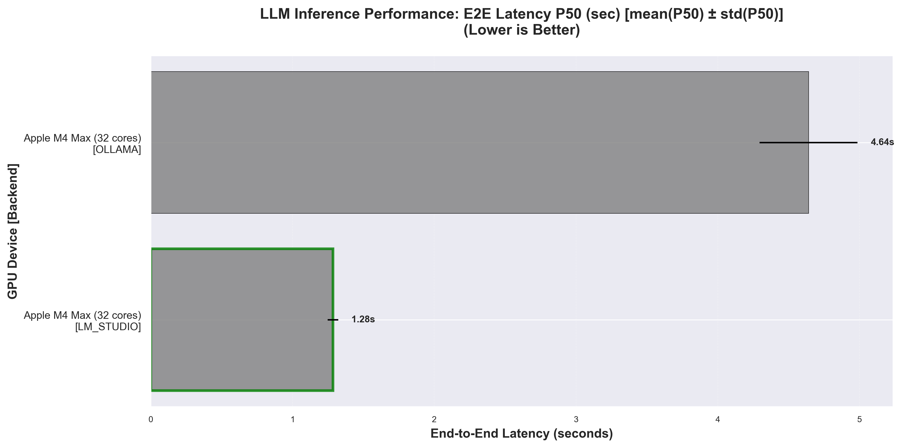
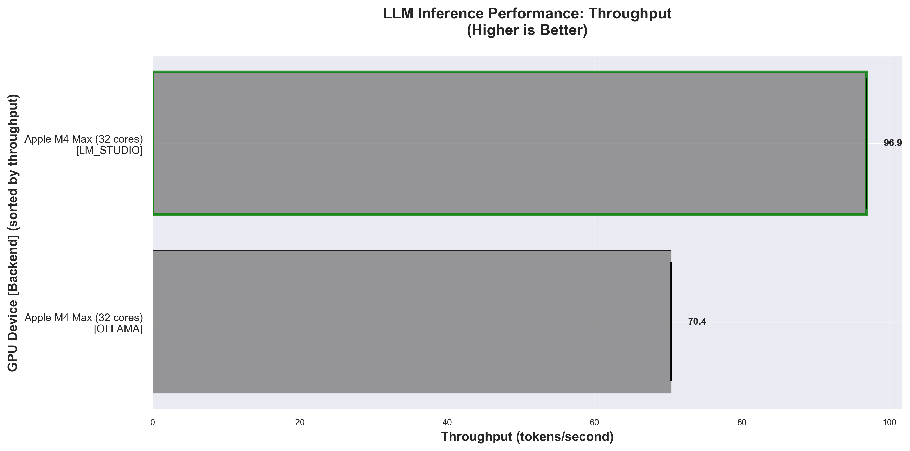
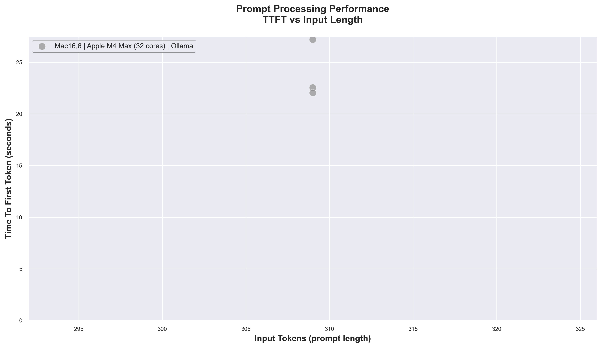
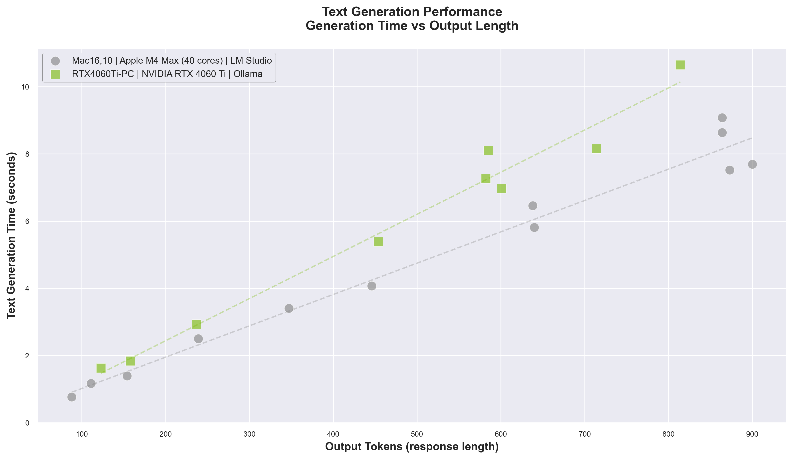
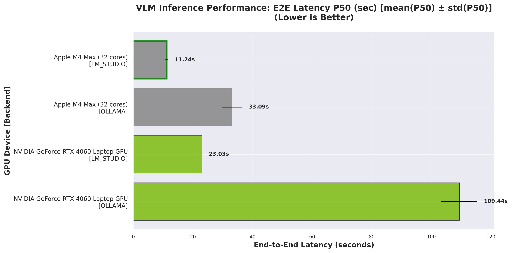

<div align="center">

# La Perf
[](https://developer.nvidia.com/cuda-zone)
[](https://developer.apple.com/metal/)
[](https://github.com/ml-explore/mlx)
[](https://github.com/bogdanminko/nobs)
[](https://github.com/bogdanminko/nobs)
### La Perf — a local AI performance benchmark
for comparing AI performance across different devices.

</div>

---
The goal of this project is to create an all-in-one source of information you need **before buying your next laptop or PC for local AI tasks**.

It’s designed for **AI/ML engineers** who prefer to run workloads locally — and for **AI enthusiasts** who want to understand real-world device performance.

## Table of Contents

- [Overview](#overview)
- [Philosophy](#philosophy)
- [Benchmark Results](#benchmark-results)
  - [Power metrics](#⚡-power-metrics)
  - [Embeddings](#embeddings)
  - [LLMs](#llms)
  - [VLMs](#vlms)
- [Quick Start](#-quick-start)
- [Contributing](#-contributing)

---

## Overview
### Tasks
La Perf is a collection of reproducible tests and community-submitted results for :
- #### **Embeddings** — ✅ Ready (sentence-transformers, [IMDB dataset](https://huggingface.co/datasets/stanfordnlp/imdb))
   sts models:
   - [thenlper/gte-large](https://huggingface.co/thenlper/gte-large)
   - [modernbert-embed-base](https://huggingface.co/nomic-ai/modernbert-embed-base)
- #### **LLM inference** — ✅ Ready (LM Studio and Ollama, [Awesome Prompts dataset](https://huggingface.co/datasets/fka/awesome-chatgpt-prompts))
   llm models:
   - **LM Studio**: [gpt-oss-20b](https://lmstudio.ai/models/openai/gpt-oss-20b)
     - *macOS*: `mlx-community/gpt-oss-20b-MXFP4-Q8` (MLX MXFP4-Q8)
     - *Other platforms*: `lmstudio-community/gpt-oss-20b-GGUF` (GGUF)
   - **Ollama**: [gpt-oss-20b](https://ollama.com/library/gpt-oss:20b)


- #### **VLM inference** — ✅ Ready (LM Studio and Ollama, [Hallucination_COCO dataset](https://huggingface.co/datasets/DogNeverSleep/Hallucination_COCO))
   vlm models:
   - **LM Studio**: [Qwen3-VL-8B-Instruct](https://lmstudio.ai/models/qwen/qwen3-vl-8b)
     - *macOS*: `lmstudio-community/Qwen3-VL-8B-Instruct-MLX-4bit` (MLX 4-bit)
     - *Other platforms*: `lmstudio-community/Qwen3-VL-8B-Instruct-GGUF-Q4_K_M` (Q4_K_M)
   - **Ollama**: [qwen3-vl:8b](https://ollama.com/library/qwen3-vl:8b)
      - **all platforms**: `qwen3-vl:8b` (Q4_K_M)
- #### **Diffusion image generation** — 📋 Planned
- #### **Speach to Text** - 📋 Planned (whisper)
- #### **Classic ML** — 📋 Planned (scikit-learn, XGBoost, LightGBM, Catboost)

**Note For mac-users**: If it's possible prefer to use lmstudio with `mlx` backend, which gives 10-20% more performance then `gguf`. If you run ollama (by default benchmarks runs both lmstudio and ollama) then you'll see a difference between `mlx` and `gguf` formats.

The `MLX` backend makes the benchmark harder to maintain, but it provides a more realistic performance view, since it’s easy to convert a `safetensors` model into an `mlx` x-bit model.

### Requirements

Laperf is compatible with **Linux**, **macOS**, and **Windows**.
For embedding tasks, **8 GB of RAM** is usually enough — sometimes even **4 GB** will work.
It’s designed to run anywhere the **`uv` package manager** is installed.

For LLM or VLM benchmarks, make sure you have **at least 16 GB of RAM** available.

Please note that this project is still in its early stages — some features like **power metrics** and **GPU power tracking** may not yet work on all devices.

It’s recommended to use a GPU from **NVIDIA**, **AMD**, **Intel**, or **Apple**, since AI workloads run significantly faster on GPUs.
Make sure to enable **full GPU offload** in tools like **LM Studio** or **Ollama** for optimal performance.

For embedding tasks, Laperf **automatically detects your available device** and runs computations accordingly.

---

## Philosophy

> *"We don’t measure synthetic FLOPS. We measure how your GPU cries in real life."*

NoBS was built to understand how different devices — from everyday laptops and PCs to large inference giants — actually perform on real AI tasks.

---

## Benchmark Results

> **Last Updated**: 2025-11-07
### 🏆 Overall Ranking

| Rank | Device | Platform | CPU | RAM | GPU | VRAM | Embeddings, sts (s) | LLM, lms (s) | LLM, ollama (s) | VLM, lms (s) | VLM, ollama (s) | Total Time (s) |
|------|------|------|------|------|------|------|------|------|------|------|------|------|
| 🥇 1 | Mac16,6 | 🍏 macOS | Apple M4 Max (14) | 36 GB | Apple M4 Max (32 cores) | shared with system RAM | 53.76 | 1.28 | 4.64 | 11.24 | 33.09 | **104.01** |

*sts - sentence transformers*

*lms - lm stuido*

*ollama - ollama*


### ⚡ Power Metrics

| Device | CPU Usage (p50/p95) | RAM Used (p50/p95) | GPU Usage (p50/p95) | GPU Temp (p50/p95) | Battery (start/end/Δ) | GPU Power (p50/p95) | CPU Power (p50/p95) |
|------|------|------|------|------|------|------|------|
| Mac16,6 | 4.0% / 12.0% | 22.3GB / 23.9GB | 97.0% / 100.0% | N/A | 85% / 85% / +0.0% | 11.7W / 32.3W | 1.1W / 2.2W |

*p50 = median, p95 = 95th percentile*


### Embeddings

#### Text Embeddings (3000 IMDB samples)

| Device | Model | RPS (mean ± std) | Time (s) (mean ± std) | Embedding Dim | Batch Size |
|------|------|------|------|------|------|
| Mac16,6 | nomic-ai/modernbert-embed-base | 55.81 ± 0.75 | 53.76 ± 0.72 | 768 | 32 |



*Throughput comparison for different embedding models across hardware. Higher values indicate better performance.*


### LLMs

#### LLM Inference (10 prompts from awesome-chatgpt-prompts)


**LM STUDIO**

| Device | Model | TPS P50 | TPS P95 | TTFT P50 (s) | TTFT P95 (s) | TG P50 (s) | TG P95 (s) | Latency P50 (s) | Latency P95 (s) | Input Tokens | Output Tokens |
|------|------|------|------|------|------|------|------|------|------|------|------|
| Mac16,6 | openai/gpt-oss-20b | 56.53 ± 1.65 | 77.21 ± 1.99 | 0.92 ± 0.02 | 1.23 ± 0.03 | 0.24 ± 0.00 | 17.09 ± 0.57 | 1.28 ± 0.04 | 18.28 ± 0.60 | 1728 | 3906 |

**OLLAMA**

| Device | Model | TPS P50 | TPS P95 | TTFT P50 (s) | TTFT P95 (s) | TG P50 (s) | TG P95 (s) | Latency P50 (s) | Latency P95 (s) | Input Tokens | Output Tokens |
|------|------|------|------|------|------|------|------|------|------|------|------|
| Mac16,6 | gpt-oss:20b | 61.03 ± 4.29 | 63.50 ± 6.07 | 4.18 ± 0.31 | 56.83 ± 0.82 | 0.46 ± 0.04 | 25.17 ± 0.33 | 4.64 ± 0.35 | 79.54 ± 0.91 | 1728 | 12939 |



*Time To First Token across prompt lengths. Lower values mean faster first responses.*




*Generation time growth relative to output length. Lower values reflect faster completions.*



*End-to-End Latency P50 - Lower is better. Measures full request-to-response time.*




*Token Generation per second (TPS) - Higher is better. Measures token generation speed.*


### VLMs

#### VLM Inference (10 questions from Hallucination_COCO)


**LM STUDIO**

| Device | Model | TPS P50 | TPS P95 | TTFT P50 (s) | TTFT P95 (s) | TG P50 (s) | TG P95 (s) | Latency P50 (s) | Latency P95 (s) | Input Tokens | Output Tokens |
|------|------|------|------|------|------|------|------|------|------|------|------|
| Mac16,6 | qwen/qwen3-vl-8b | 51.47 ± 1.30 | 53.62 ± 1.82 | 1.58 ± 0.01 | 1.77 ± 0.07 | 9.62 ± 0.48 | 13.42 ± 0.37 | 11.24 ± 0.48 | 15.06 ± 0.30 | 310 | 5966 |

**OLLAMA**

| Device | Model | TPS P50 | TPS P95 | TTFT P50 (s) | TTFT P95 (s) | TG P50 (s) | TG P95 (s) | Latency P50 (s) | Latency P95 (s) | Input Tokens | Output Tokens |
|------|------|------|------|------|------|------|------|------|------|------|------|
| Mac16,6 | qwen3-vl:8b | 47.78 ± 4.93 | 49.61 ± 6.79 | 15.29 ± 1.24 | 27.64 ± 0.60 | 16.28 ± 0.91 | 19.59 ± 1.52 | 33.09 ± 3.44 | 44.33 ± 0.41 | 1814 | 15490 |



*TTFT behaviour for multimodal prompts. Lower values mean faster first visual-token outputs.*




*Generation time vs output token count for multimodal responses. Lower values are faster.*



*End-to-End Latency P50 - Lower is better. Measures full request-to-response time.*


*Token Generation per second (TPS) - Higher is better. Measures token generation speed.*


---
_All metrics are shown as median ± standard deviation across 3 runs. Lower times are better (faster performance)._

## ⚡ Quick Start

### Prerequisites
- Python 3.12+
- [uv](https://docs.astral.sh/uv/) package manager

### Installation
```sh
# Clone the repository
git clone https://github.com/bogdanminko/nobs.git
cd nobs

# Install dependencies
uv sync
```

### Running Benchmarks

#### Run all benchmarks
```sh
uv run python main.py
```

This will:
1. Auto-detect your hardware (CUDA/MPS/CPU)
2. Run all available benchmarks
3. Save results to `results/report_{your_device}.json`

#### Run specific benchmarks
```sh
# Embeddings only
uv run python -m src.tasks.text_embeddings.runner

# LLM inference (requires LM Studio running on localhost:1234)
uv run python -m src.tasks.llms.runner
```

#### LLM Benchmarks Setup

**Note:** LLM benchmarks currently require [LM Studio](https://lmstudio.ai/) running locally.

1. Download and install [LM Studio](https://lmstudio.ai/)
2. Load a model in LM Studio
3. Start the local server (default: `http://localhost:1234`)
4. Run the LLM benchmark:
   ```sh
   uv run python -m src.tasks.llms.runner
   ```

---

## 🤝 Contributing

We welcome contributions! Whether it's adding new benchmarks, supporting new models, or submitting your hardware results.

### Development Setup

1. **Fork and clone the repository**
   ```sh
   git clone https://github.com/YOUR_USERNAME/laperf.git
   cd laperf
   ```

2. **Install dependencies including dev tools**
   ```sh
   uv sync --group quality --group dev
   ```

3. **Install pre-commit hooks**
   ```sh
   pre-commit install
   ```

   This sets up automatic code quality checks that run before each commit:
   - **ruff** — Fast Python linter and formatter
   - **mypy** — Static type checking
   - **bandit** — Security vulnerability scanner
   - Standard checks (trailing whitespace, YAML syntax, etc.)

### Making Changes

1. **Create a new branch**
   ```sh
   git checkout -b feature/your-feature-name
   ```

2. **Make your changes**
   - Write code following the existing patterns
   - Add type hints where applicable
   - Update documentation if needed

3. **Test your changes**
   ```sh
   # Run benchmarks to ensure they work
   uv run python main.py

   # Update benchmark results tables (if you modified results)
   make

   # Run code quality checks manually (optional - pre-commit will run them automatically)
   make format
   ```

   **Available Makefile commands:**
   - `make` — Generate benchmark results tables (default)
   - `make generate` — Generate benchmark results tables
   - `make format` — Run pre-commit hooks on all files
   - `make lint` — Run ruff linter only
   - `make clean` — Clean Python cache files
   - `make help` — Show all available commands

4. **Commit your changes**
   ```sh
   git add .
   git commit -m "feat: your descriptive commit message"
   ```

   Pre-commit hooks will automatically:
   - Format your code
   - Check for type errors
   - Scan for security issues
   - Fix common issues (trailing whitespace, etc.)

   If any check fails, fix the issues and commit again.

5. **Push and create a Pull Request**
   ```sh
   git push origin feature/your-feature-name
   ```

### Code Quality Standards

All contributions must pass:
- ✅ **Ruff** linting and formatting
- ✅ **Mypy** type checking
- ✅ **Bandit** security checks

These are enforced automatically via pre-commit hooks.

### Adding New Benchmarks

See [CLAUDE.md](CLAUDE.md) for detailed instructions on:
- Adding new models to existing benchmarks
- Creating new benchmark categories
- Data loading patterns
- Memory management best practices

Tip: Add CLAUDE.md when working with your AI coding assistant — it helps provide full project context.

---
