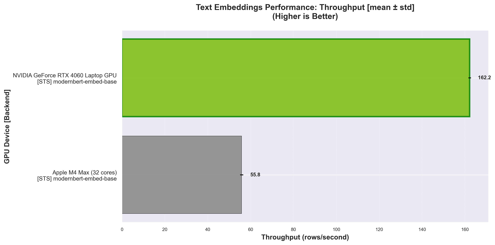
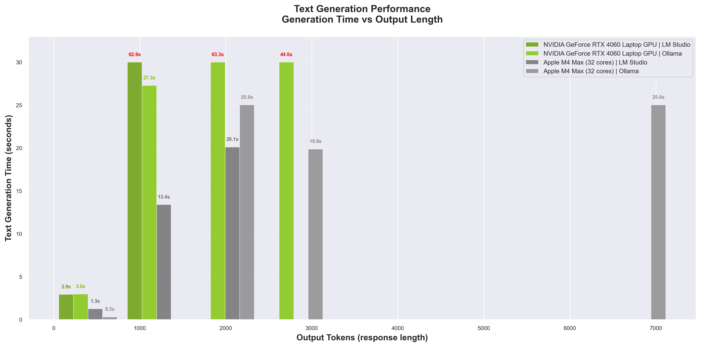
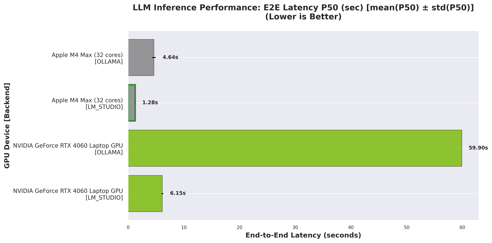
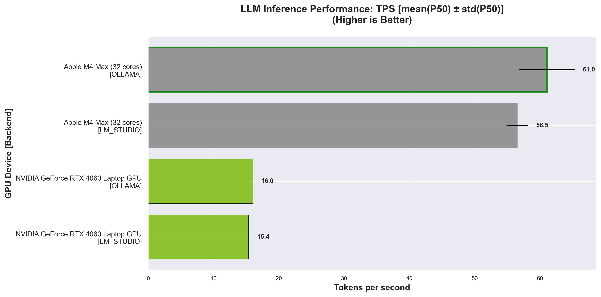
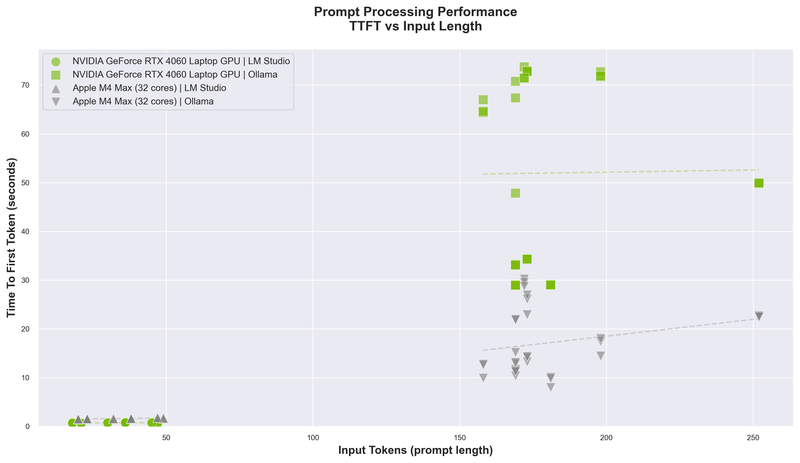
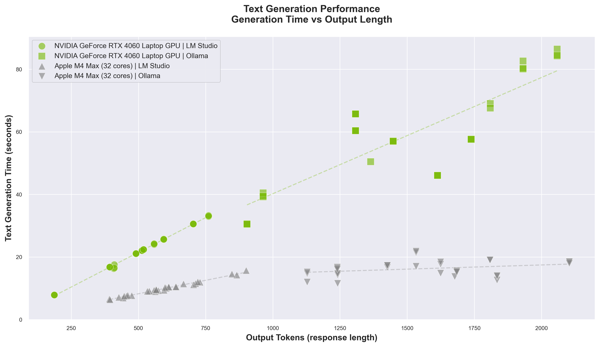

## Benchmark Results

> **Last Updated**: 2025-11-10

### ⚡ Power Metrics

| Device | CPU Usage (p50/p95) | RAM Used (p50/p95) | GPU Usage (p50/p95) | GPU Temp (p50/p95) | Battery (start/end/Δ) | GPU Power (p50/p95) | CPU Power (p50/p95) |
|------|------|------|------|------|------|------|------|
| ASUSTeK COMPUTER ASUS Vivobook Pro N6506MV | 24.2% / 25.7% | 10.8GB / 13.2GB | 16.0% / 41.0% | 64.0°C / 66.0°C | 99.0% / 100.0% / -1.0% | 18.3W / 44.8W | N/A |
| Mac16,6 | 4.0% / 12.0% | 22.3GB / 23.9GB | 97.0% / 100.0% | N/A | 85% / 85% / +0.0% | 11.7W / 32.3W | 1.1W / 2.2W |

*p50 = median, p95 = 95th percentile*

### Embeddings

#### Text Embeddings (3000 IMDB samples)

_RPS = Rows Per Second — number of text samples encoded per second._

| Device | Model | RPS (mean ± std) | Time (s) (mean ± std) | Embedding Dim | Batch Size |
|------|------|------|------|------|------|
| ASUSTeK COMPUTER ASUS Vivobook Pro N6506MV | nomic-ai/modernbert-embed-base | 162.17 ± 0.61 | 18.50 ± 0.07 | 768 | 32 |
| Mac16,6 | nomic-ai/modernbert-embed-base | 55.81 ± 0.75 | 53.76 ± 0.72 | 768 | 32 |

*Throughput comparison for different embedding models across hardware. Higher values indicate better performance.*

### LLMs

#### LLM Inference (10 prompts from awesome-chatgpt-prompts)

**LM STUDIO**

| Device | Model | TPS P50 | TPS P95 | TTFT P50 (s) | TTFT P95 (s) | TG P50 (s) | TG P95 (s) | Latency P50 (s) | Latency P95 (s) | Input Tokens | Output Tokens |
|------|------|------|------|------|------|------|------|------|------|------|------|
| ASUSTeK COMPUTER ASUS Vivobook Pro N6506MV | openai/gpt-oss-20b | 15.36 ± 0.10 | 16.81 ± 0.17 | 3.12 ± 0.07 | 6.36 ± 0.07 | 0.93 ± 0.13 | 65.72 ± 0.98 | 6.15 ± 0.15 | 69.19 ± 0.87 | 1728 | 4004 |
| Mac16,6 | openai/gpt-oss-20b | 56.53 ± 1.65 | 77.21 ± 1.99 | 0.92 ± 0.02 | 1.23 ± 0.03 | 0.24 ± 0.00 | 17.09 ± 0.57 | 1.28 ± 0.04 | 18.28 ± 0.60 | 1728 | 3906 |

**OLLAMA**

| Device | Model | TPS P50 | TPS P95 | TTFT P50 (s) | TTFT P95 (s) | TG P50 (s) | TG P95 (s) | Latency P50 (s) | Latency P95 (s) | Input Tokens | Output Tokens |
|------|------|------|------|------|------|------|------|------|------|------|------|
| ASUSTeK COMPUTER ASUS Vivobook Pro N6506MV | gpt-oss:20b | 16.03 ± 0.04 | 16.43 ± 0.02 | 35.68 ± 13.48 | 158.11 ± 0.38 | 4.53 ± 0.05 | 74.99 ± 1.27 | 59.90 ± 0.02 | 199.34 ± 0.39 | 1728 | 13563 |
| Mac16,6 | gpt-oss:20b | 61.03 ± 4.29 | 63.50 ± 6.07 | 4.18 ± 0.31 | 56.83 ± 0.82 | 0.46 ± 0.04 | 25.17 ± 0.33 | 4.64 ± 0.35 | 79.54 ± 0.91 | 1728 | 12939 |

*Time To First Token across prompt lengths. Lower values mean faster first responses.*

*Generation time growth relative to output length. Lower values reflect faster completions.*

*End-to-End Latency P50 - Lower is better. Measures full request-to-response time.*

*Token Generation per second (TPS) - Higher is better. Measures token generation speed.*

### VLMs

#### VLM Inference (10 questions from Hallucination_COCO)

**LM STUDIO**

| Device | Model | TPS P50 | TPS P95 | TTFT P50 (s) | TTFT P95 (s) | TG P50 (s) | TG P95 (s) | Latency P50 (s) | Latency P95 (s) | Input Tokens | Output Tokens |
|------|------|------|------|------|------|------|------|------|------|------|------|
| ASUSTeK COMPUTER ASUS Vivobook Pro N6506MV | qwen/qwen3-vl-8b | 22.43 ± 0.08 | 23.20 ± 0.55 | 0.75 ± 0.05 | 0.84 ± 0.05 | 22.24 ± 0.03 | 31.98 ± 0.10 | 23.03 ± 0.06 | 32.65 ± 0.10 | 290 | 5128 |
| Mac16,6 | qwen/qwen3-vl-8b | 51.47 ± 1.30 | 53.62 ± 1.82 | 1.58 ± 0.01 | 1.77 ± 0.07 | 9.62 ± 0.48 | 13.42 ± 0.37 | 11.24 ± 0.48 | 15.06 ± 0.30 | 310 | 5966 |

**OLLAMA**

| Device | Model | TPS P50 | TPS P95 | TTFT P50 (s) | TTFT P95 (s) | TG P50 (s) | TG P95 (s) | Latency P50 (s) | Latency P95 (s) | Input Tokens | Output Tokens |
|------|------|------|------|------|------|------|------|------|------|------|------|
| ASUSTeK COMPUTER ASUS Vivobook Pro N6506MV | qwen3-vl:8b | 13.60 ± 0.08 | 14.12 ± 0.06 | 54.82 ± 5.26 | 72.83 ± 0.45 | 58.42 ± 1.03 | 83.23 ± 0.56 | 109.44 ± 6.02 | 152.33 ± 1.20 | 1814 | 14636 |
| Mac16,6 | qwen3-vl:8b | 47.78 ± 4.93 | 49.61 ± 6.79 | 15.29 ± 1.24 | 27.64 ± 0.60 | 16.28 ± 0.91 | 19.59 ± 1.52 | 33.09 ± 3.44 | 44.33 ± 0.41 | 1814 | 15490 |

*TTFT behaviour for multimodal prompts. Lower values mean faster first visual-token outputs.*

*Generation time vs output token count for multimodal responses. Lower values are faster.*

*End-to-End Latency P50 - Lower is better. Measures full request-to-response time.*

*Token Generation per second (TPS) - Higher is better. Measures token generation speed.*

---
_All metrics are shown as mean ± standard deviation across 3 runs. 